# Architecture

## Runtime flow

```mermaid
flowchart LR
    Landing["Immutable batch + READY"] --> Registry["InputRegistry"]
    Registry --> DB[("SQLAlchemy result database")]
    Registry --> Sensor["Dagster sensor"]
    Sensor --> Partition["sample_id dynamic partition"]
    Partition --> Compute["one ComputeResource invocation"]
    Compute --> Allocation["local process or one Slurm allocation"]
    Allocation --> Core["Bactopia core"]
    Core --> CheckM2["Bactopia CheckM2"]
    CheckM2 --> Sylph["Bactopia Sylph"]
    Sylph --> Parser["structural parser + QualityPolicy"]
    Parser --> DB
    Parser --> Store["immutable ArtifactStore"]
    Parser --> Projector["ATB projector"]
    Projector --> Parquet["five tables + sample view"]
    Parquet --> Store
```



The five Dagster assets are logical views of one sample computation. They use a
single multi-asset compute boundary, which is the unit submitted by
`dagster-slurm`. Bactopia's Nextflow executor remains local inside the
allocation. No process submits another Slurm job.

## Deep modules

| Module | Owns | Does not own |
|---|---|---|
| `InputRegistry` | landing contract, stability, confinement, checksums | Dagster runs |
| `ResultRepository` | identity, lifecycle, normalized persistence | scientific parsing |
| `BactopiaRunner` | resolved argument-array execution and exit status | database writes |
| `ArtifactStore` | staging, atomic publication, immutable URIs/checksums | output meaning |
| `BactopiaResultParser` | output discovery, coercion, assembly statistics | execution |
| `QualityPolicy` | biological warning/filter semantics | structural validity |
| `AtbProjector` | strict/extended schemas, Parquet, wide DataFrame | source identity |
| Dagster layer | discovery cadence, partitions, idempotent scheduling | domain behavior |

The seams with more than one implementation are intentionally narrow:
`BactopiaRunner` has real and fake adapters; `ComputeResource` has local and
Slurm modes. SQLAlchemy's dialect boundary supplies DuckDB and SQL Server
portability without database-specific domain code.

## Identity and idempotency

Every batch, sample, analysis, and artifact receives a UUID4. UUIDs are durable
export/import identifiers. They are not public accessions.

The run key is:

```text
sha256(sample_id + input_fingerprint + pipeline_configuration_fingerprint)
```

The database additionally enforces uniqueness for the same sample, input
fingerprint, and configuration fingerprint. Exact non-null namespaced source
identifiers may support later reconciliation; labels and filenames never do.

## Failure boundaries

Before registration, a sample may be ignored (not ready or not stable) or
reported invalid. After registration, input mutation invalidates the record.

During analysis, every attempt receives a new staging directory. Non-zero
commands or structurally invalid output fail the analysis and retain the
workspace/logs. Biological quality failures produce filter values but remain
successful analyses. Scientific artifacts are published only after all
required outputs parse.

## Storage

The v1 artifact adapter uses local/shared filesystems:

```text
artifacts/samples/<sample_id>/analyses/<analysis_id>/
├── staging/
├── failed/
└── published/
    └── attempt-0001/
```

Database rows hold file URIs, sizes, and SHA-256 digests. The interface leaves
room for a future object store and explicit Slurm scratch staging without
changing scientific logic.

Nextflow `versions.yml` and trace reports remain immutable artifacts. The
parser also normalizes reported software versions and task-container names;
an `@sha256` digest is stored when the trace provides one. Missing upstream
digests remain null rather than being inferred from mutable tags.

## Deployment state

Dagster operational state and scientific result state are separate:

- Host development: Dagster's configured local instance plus DuckDB results.
- Compose: PostgreSQL for Dagster and DuckDB for results.
- Slurm: Dagster control plane plus a configured portable result database;
  shared filesystem is required in v1.

For SQL Server, install the `mssql` optional dependency and set a SQLAlchemy
`mssql+pyodbc://...` URL. Migrations and repositories use portable SQLAlchemy
constructs only.
